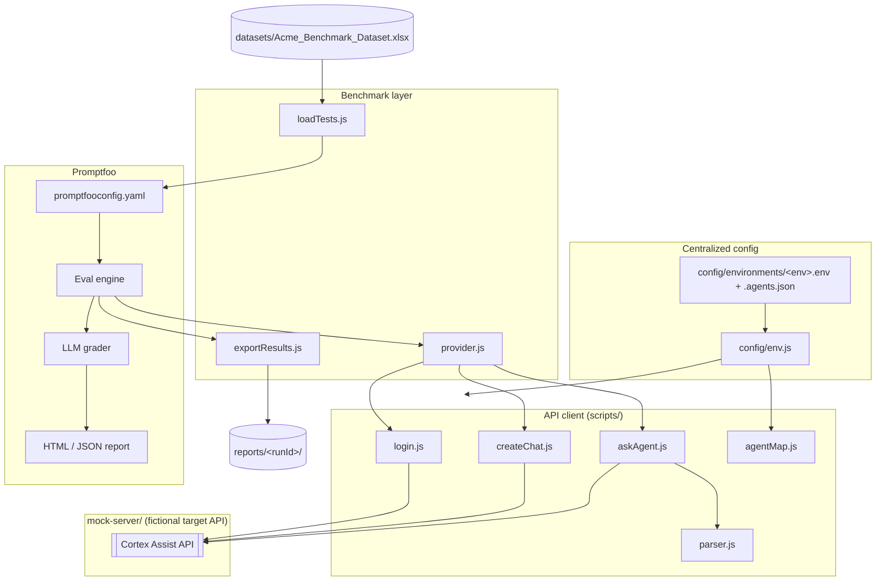
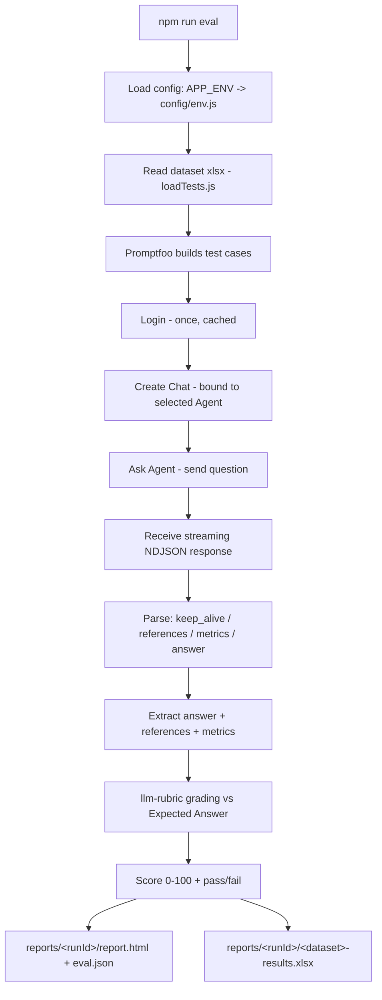
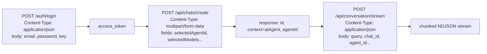
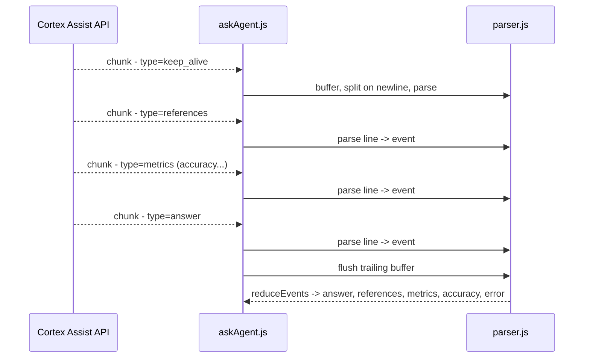
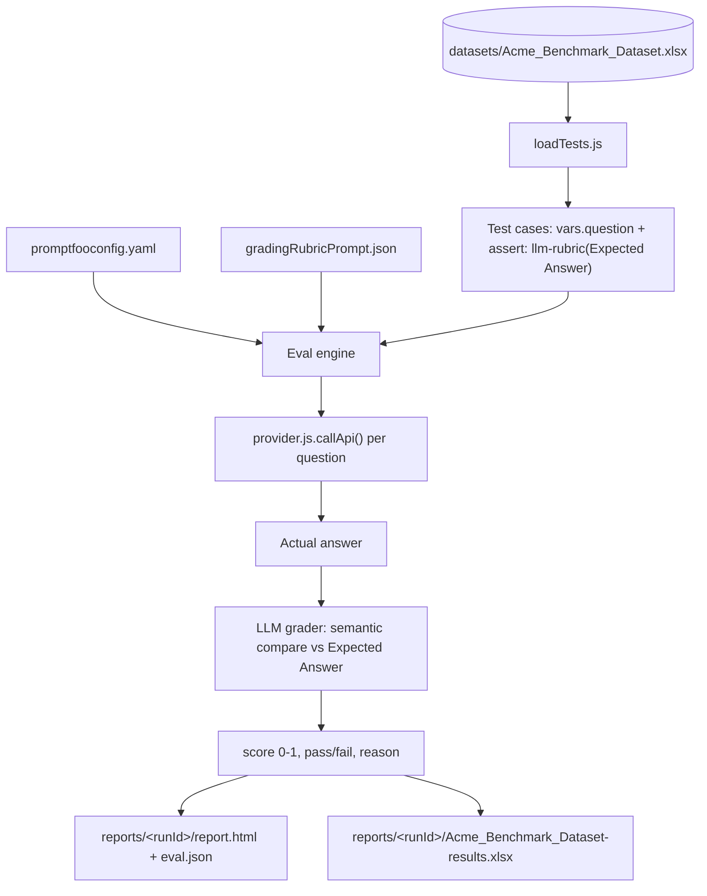
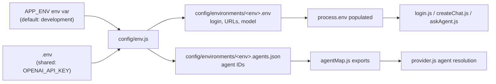
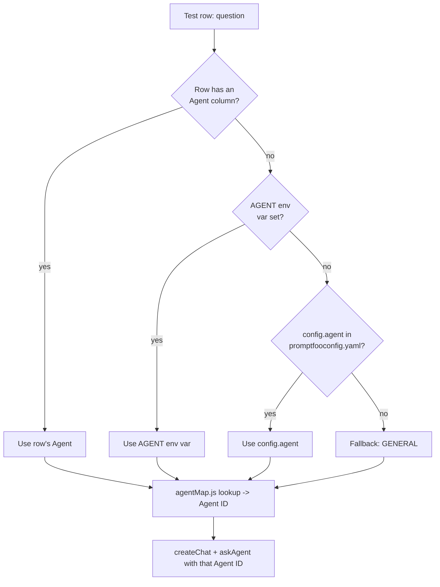

# RAG Agent Benchmark Framework

[](LICENSE)
[](package.json)
[](https://www.promptfoo.dev/)

A [Promptfoo](https://www.promptfoo.dev/)-based benchmark framework for multi-agent
RAG chat APIs: it logs in, creates a chat, asks a specialized agent a benchmark
question, parses a streamed response, grades the answer semantically against
an expected reference, and produces a report.

This repo is **fully self-contained** — it ships a small mock API
("Cortex Assist", a fictional multi-agent assistant for a fictional company,
"Acme Corp") and a 120-question sample dataset, so the whole pipeline runs
end-to-end on your machine with zero real credentials and zero external
services beyond an LLM grading key.

**Highlights**

- **Multi-agent routing** — one dataset, six specialized agents (HR, Legal, Finance, IT, Sales, General), resolved per-row, per-run, or per-environment
- **Real streaming, not text()** — consumes chunked NDJSON incrementally via `response.body.getReader()`, matching how real chat APIs actually stream
- **Semantic grading, not string match** — an LLM rubric grades intent/facts against a reference answer, with 0–100 partial credit
- **Environment-driven config** — switch `development` → `staging` → `production` with one env var, zero file edits
- **Round-trips to spreadsheet** — results are exported back into the original `.csv`/`.xlsx` shape, ready to diff or share with non-engineers

```bash
npm install
cp .env.example .env        # add your own OPENAI_API_KEY (used only for grading)
npm run mock-server          # terminal 1: starts the fake target API on :4000
npm run eval                 # terminal 2: runs the full benchmark against it
npm run report                # opens the interactive results viewer
```

## 1. Overall architecture



## 2. End-to-end execution flow



## 3. API contract (implemented by mock-server/)



> `/api/chats/create` intentionally **requires** `multipart/form-data` (field
> `selectedAgentId`) and rejects JSON outright. This mirrors a real
> integration lesson: some real backends silently ignore an unparseable JSON
> body instead of rejecting it, which is a much harder bug to track down.
> See [`mock-server/server.js`](mock-server/server.js) and
> [`scripts/createChat.js`](scripts/createChat.js).

## 4. Streaming response flow



> Not Server-Sent Events — raw newline-delimited JSON over a chunked HTTP
> response. The mock server can report an application-level error (e.g. an
> unknown agent) while still returning HTTP 200, so success/failure can only
> be read from the parsed stream content, never the status code alone.
> `askAgent.js` reads the stream incrementally via
> `response.body.getReader()`, not `response.text()`.

## 5. Promptfoo evaluation flow



Grading is **semantic**, not strict text-matching — the LLM grader (rules in
[`scripts/gradingRubricPrompt.json`](scripts/gradingRubricPrompt.json))
compares intent, key facts, and figures against the reference answer.
Different wording or added correct context doesn't fail a row; a materially
different fact/number, a fabricated value, or a missed contradiction does.
`Score` (0–100) reflects partial credit, not just pass/fail.

The mock server deliberately returns a **realistic mix** of correct,
degraded, and off-target answers (see `generateAnswer()` in
[`mock-server/server.js`](mock-server/server.js)) instead of always being
right — so a benchmark run here demonstrates the grading pipeline actually
catching real mistakes, not just rubber-stamping a 100% pass rate.

## 6. Folder structure

```mermaid
flowchart TD
    ROOT["rag-agent-benchmark/"] --> ENVF[.env.example]
    ROOT --> PFYAML[promptfooconfig.yaml]
    ROOT --> PKG[package.json]
    ROOT --> CONFIG[config/]
    ROOT --> DATASETS[datasets/]
    ROOT --> REPORTS[reports/]
    ROOT --> SCRIPTS[scripts/]
    ROOT --> MOCK[mock-server/]
    ROOT --> TESTS[Tests/]

    CONFIG --> ENVJS[env.js]
    CONFIG --> ENVDIR[environments/]
    ENVDIR --> DEVENV["development.env + .agents.json (mock server)"]
    ENVDIR --> STAGINGENV["staging.env + .agents.json (template)"]
    ENVDIR --> PRODENV["production.env + .agents.json (template)"]

    MOCK --> MOCKSERVER[server.js]
    MOCK --> MOCKAGENTS[agents.js]

    SCRIPTS --> LOGIN[login.js]
    SCRIPTS --> CREATECHAT[createChat.js]
    SCRIPTS --> ASKAGENT[askAgent.js]
    SCRIPTS --> PARSER[parser.js]
    SCRIPTS --> AGENTMAP[agentMap.js]
    SCRIPTS --> PROVIDER[provider.js]
    SCRIPTS --> LOADTESTS[loadTests.js]
    SCRIPTS --> DATASETIO[datasetIO.js]
    SCRIPTS --> RUBRIC[gradingRubricPrompt.json]
    SCRIPTS --> EXPORTRESULTS[exportResults.js]
    SCRIPTS --> RUNEVAL[runEval.js]
    SCRIPTS --> GENDATA[generateSampleDataset.js]

    REPORTS --> LATESTTXT["LATEST.txt - points to newest run"]
    REPORTS --> RUNDIR["&lt;timestamp&gt;_&lt;env&gt;_&lt;agent&gt;/ - one folder per run"]
    RUNDIR --> RHTML[report.html]
    RUNDIR --> REJSON[eval.json]
    RUNDIR --> RXLSX["Acme_Benchmark_Dataset-results.xlsx"]
```



## 7. Sequence diagram (one test case, full detail)

```mermaid
sequenceDiagram
    actor Dev as Developer
    participant PF as Promptfoo engine
    participant Prov as provider.js
    participant API as Cortex Assist API (mock)
    participant Grader as LLM grader

    Dev->>PF: npm run eval
    PF->>Prov: callApi(question, context)
    Prov->>API: POST login (once, cached across all questions)
    API-->>Prov: access_token
    Prov->>API: POST /api/chats/create (multipart/form-data)
    API-->>Prov: chat_id
    Prov->>API: POST /api/conversation/stream
    API-->>Prov: NDJSON stream
    Prov-->>PF: output=answer, metadata=references+metrics+accuracy
    PF->>Grader: grade(answer, expectedAnswer, rubricPrompt)
    Grader-->>PF: pass, score, reason
    PF-->>Dev: reports/&lt;runId&gt;/ (report.html + eval.json + results.xlsx)
```

## 8. Environment configuration flow



Switch environments with one variable, no file edits:

```bash
APP_ENV=staging npm run eval                          # bash / git-bash
$env:APP_ENV="staging"; npm run eval                   # PowerShell
```

`development` points at the bundled mock server and works out of the box;
`staging`/`production` are templates (`TODO` placeholders) for pointing this
same framework at a real deployment. An unknown `APP_ENV` fails fast with a
clear error listing what's available.

## 9. Multi-agent workflow



Three ways to run different datasets against different agents (composable):

```bash
# 1. Same dataset, different agent - no file edits
AGENT=LEGAL npm run eval

# 2. A separate dataset per agent
AGENT=LEGAL BENCHMARK_DATASET=datasets/my_legal_questions.csv npm run eval

# 3. One mixed dataset, routed per row - the bundled dataset already does
#    this via its "Agent" column (see datasets/Acme_Benchmark_Dataset.xlsx)
```
`HR, LEGAL, FINANCE, IT, SALES, GENERAL` — any key from
`config/environments/<env>.agents.json`.

## The mock server

`mock-server/server.js` implements the fictional "Cortex Assist" API well
enough to exercise the entire framework:

- `POST /auth/login` — accepts any non-empty email/password/key, returns a
  fake bearer token
- `POST /api/chats/create` — requires `multipart/form-data`; returns 400 on
  a JSON body (see §3)
- `POST /api/conversation/stream` — streams NDJSON (`keep_alive` →
  `references` → `metrics` → `answer`); matches the incoming question
  against `datasets/Acme_Benchmark_Dataset.xlsx` by word overlap, then
  returns the correct answer ~72% of the time, a degraded/truncated answer
  ~14% of the time, and an off-target answer ~14% of the time — so a
  benchmark run produces a believable, non-trivial pass rate

Regenerate or extend the sample dataset with
`node scripts/generateSampleDataset.js` (edit the `SHEETS` object at the top
of the file to add more questions/agents).

## Dataset schema

| Column | Required | Meaning |
|---|---|---|
| `Question` | **yes** | Sent to the agent; also the join key `exportResults.js` uses, so keep it unique within a dataset |
| `Expected Answer` | recommended | Reference answer graded against (see §5). Omit to run ungraded. |
| `Agent` | no | Per-row agent override (§9) - `HR Agent`, `Legal Agent`, etc. are normalized automatically |
| `S.No`, `Query Category`, `Scenario Type`, `Source Document` | no | Metadata/labeling only |

`loadTests.js`/`datasetIO.js` accept both `.csv` (single sheet) and
`.xlsx`/`.xls` (any number of sheets, one per agent) — column names can vary
slightly (`Question` vs `User Query`, leading/trailing spaces) and are
resolved via alias matching.

## Getting results back in dataset format

Every `npm run eval` creates one new folder,
`reports/<timestamp>_<env>_<agent>/`, holding everything from that run —
nothing is overwritten, and the whole folder is self-contained:

```
reports/
├── LATEST.txt
└── 2026-07-24_14-30-00_development_default/
    ├── report.html                                  <- open directly in any browser
    ├── eval.json                                     <- raw Promptfoo output
    └── Acme_Benchmark_Dataset-results.xlsx           <- same shape as the input, with
                                                           Answer in Staging / Score / Pass-Fail filled in
```

Re-export the most recent run on its own with `npm run export`.

## Pointing this at a real product

1. Set `LOGIN_URL`, `API_BASE_URL`, `CONVERSATION_STREAM_PATH`, `MODEL`, and
   real credentials in `config/environments/<env>.env`.
2. Set real agent IDs in `config/environments/<env>.agents.json`.
3. Swap in your real benchmark questions under `datasets/`.
4. If the real API's contract differs from `mock-server/server.js` (e.g.
   different field names, different streaming event shape), adjust
   `scripts/createChat.js` / `scripts/askAgent.js` / `scripts/parser.js`
   accordingly — everything downstream (grading, reporting, export) is
   generic and doesn't need to change.

## Troubleshooting

- **`ECONNREFUSED` on login** — start the mock server first: `npm run mock-server`.
- **`Unknown environment "X"`** — no matching `config/environments/X.env`; the error lists what's available.
- **`Unknown agent "X"`** — `AGENT`, `config.agent`, or a dataset's `Agent` column doesn't match a key in the resolved environment's `agents.json`.
- **Grading feels off** — tune `scripts/gradingRubricPrompt.json`; it's the single place grading behavior is controlled.
- **All the mock server's answers look the same** — it's randomized per call; run again or check `Math.random()` isn't being seeded elsewhere.
